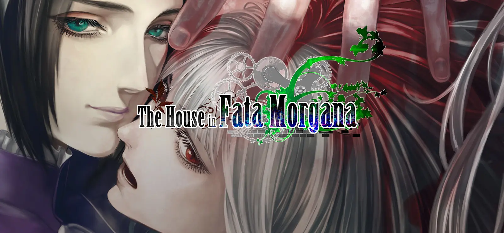
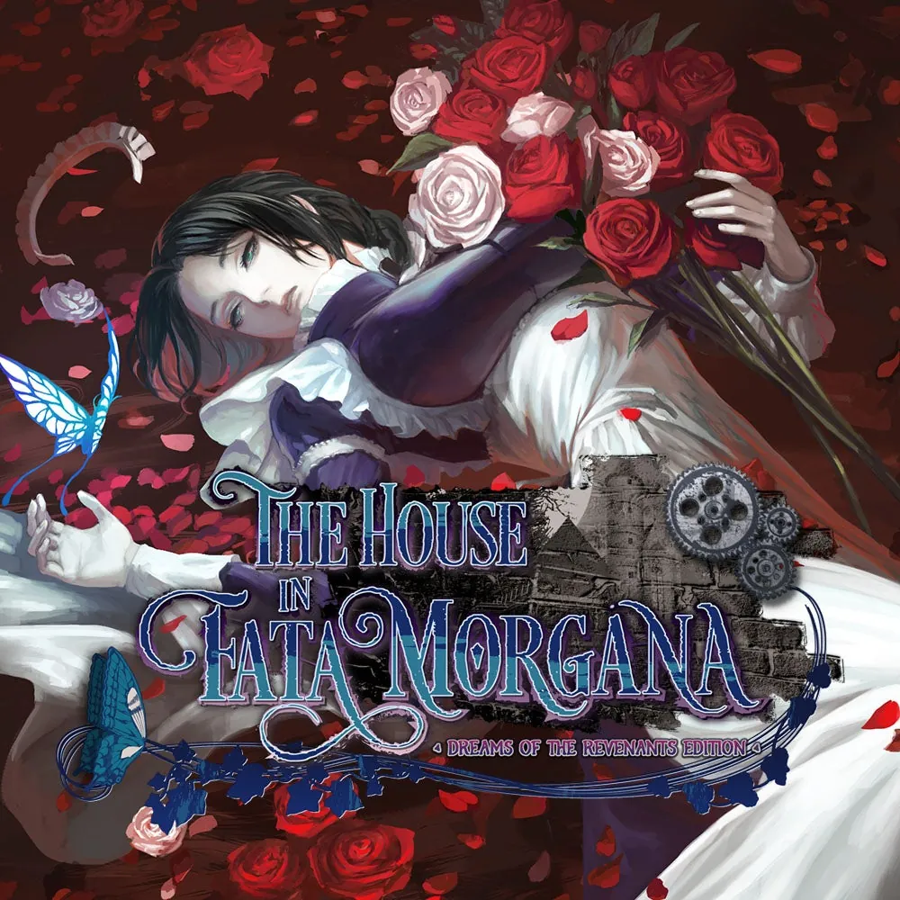
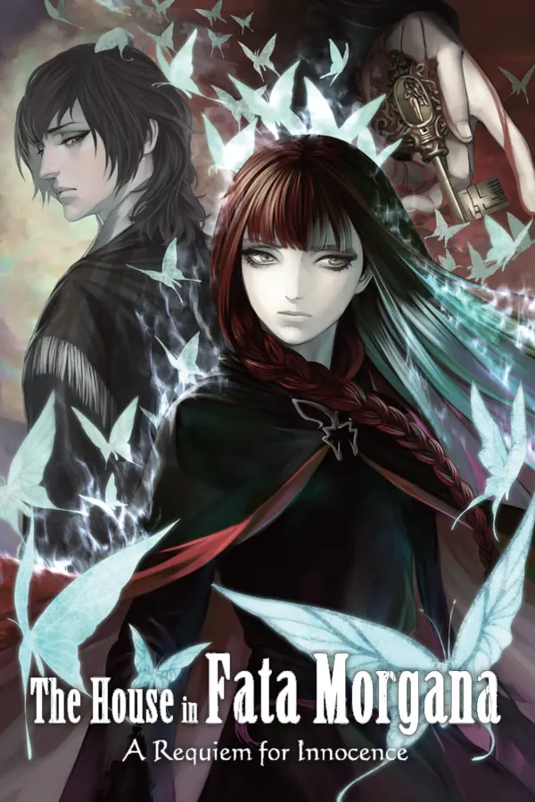
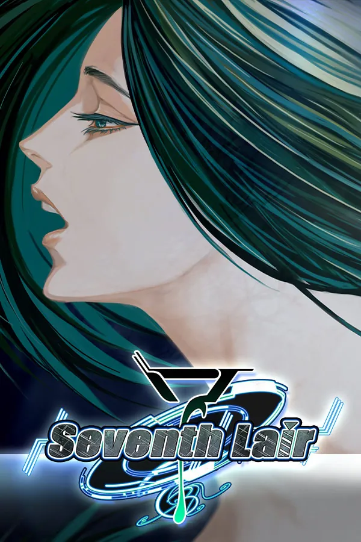
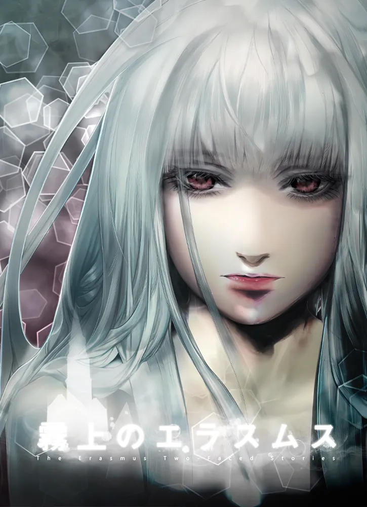

??? info "Sayfanın amacı"
    Bu sayfa genel olarak The House in Fata Morgana görsel romanını deneyimlemeden once hakkında bilgi edinmek isteyenler için yapılmıştır. 
    Direkt kuruluma geçmek istiyorsanız sol taraftan kuruluma ulaşabilirsiniz.

# The House in Fata Morgana hakkında

---

{ width="800px" }

---

## Giriş

**The House in Fata Morgana** *(ファタモルガーナの館 Fata Morugāna no Yakata)*, **FataMoru** olarak da anılan görsel roman serisinin ana oyunudur.

Oyun ilk olarak Microsoft Windows için 31 Aralık, 2012'de Japonya'da çıkış yaptı. Sonrasında MangaGamer tarafından 13 Mayıs, 2016 tarihinde globale açıldı.

Fata Morgana'nın iki versiyonu bulunuyor, birincisi Steam'de de şu an satılan orjinal versiyon, ikincisi ise 2019 yılında Limited Run Games tarafından piyasaya sürülen ve oyunun görsel iyileştirmelerini, yeni içeriklerini içeren geliştirilmiş bir versiyon. Sayfanın ilerleyen bölümlerinde daha detaylı açıklamasını bulabilirsiniz.

Hikayenin ilk yarısı antoloji formatında olmasıyla beraber oyun sekiz farklı bölümden *(kapıdan)* oluşuyor.

## Konu

Yıkık dökük eskimiş bir köşkte uyanıyorsun. Hizmetçiye benzeyen bir kadın zümrüt yeşili gözleriyle karşında sana bakıyor. Fakat, ne kendine dair bir hatıran var, ne de hayatta olduğuna dair bir inancın.

Hizmetçi, bu köşkteki ziyaretçilerin başına gelmiş sayısız trajediyi gözlerinin önüne sermek için Seni geçmişte bir yolculuğa çıkarıyor. Aralarından birinde, kendi izlerini bulman umuduyla.

> Altımda uzanan cesede bakıyordum. Kendi cesedime. Çarmıha gerileceğim yere doğru sürüklenişini gördüğümde derin bir umutsuzluğa kapılmıştım. Ruhum paramparça oldu, ve büsbütün söndüm. Doğrusu, vaktiyle her şeyimi yitirdim. Lâkin... ebedî karanlığın içine doğru kaybolurken, beni çağıran bir ses işittim. Ve böylece, bir kez daha ant içtim ki, ne kadar uzun sürerse sürsün, karşıma çıkan engeller ne kadar büyük olursa olsun, veya hangi şekle bürünürsen bürün, senin için geri döneceğim.

>O eve geri dönmeliyim.

## Süreç & Tema

Oyun Keika Hanada tarafından yazıldı, Moyataro tarafından çizildi ve Hanada'nın kurduğu NOVECT şirketi tarafından geliştirildi. 

Hanada 1 yıldan fazla bir süre boyunca hikayeyi planladı. Zaman zaman edebi bir dil kullansa da, oyuncu ile bağı koparmamak için oyun çoğunlukla modern bir Japonca ile yazıldı. **Shakespeare**, **Tanith Lee** gibi yazarlar, Satoshi Kon'un yönettiği **Millennium Actress** filmi ve **Shin Megami Tensei**, **Ace Attorney**, **Danganronpa** serileri esinlendiği şeylerin sadece birkaçı. 

Moyataro'nun sanat tarzı Japon Anime tarzına değil, gerçekçi hatlara ve renklere sahip bir tarza yakındı, bundan mütevellit bu oyun çoğu görsel romanda görmeye alışık olmadığımız bir çizim estetiğine sahip.

Oyunun bana yeni bir paragraf açtıran bir diğer eşsiz yanı ise müzikleri: Bu album üzerinde beş farklı besteci toplam 65 farklı parça/şarkı yazdı. Yarısından fazlası Portekizce sözler içeren bu Neoklasik, Orkestral müzikler kesinlikle sizi hikayenin içerisine dahil eden ve deneyiminizi başka bir boyuta taşıyacak yegâne etkenlerden biri.

## Yeniden yapım & Serideki diğer oyunlar
<figure style="float: left; margin-right: 1em;">

<figcaption>Dreams of the Revenants'ın kapağı</figcaption>
</figure>
### Dreams of the Revenants

**The House in Fata Morgana: Dreams of the Revenants** Playstation Vita, Nintendo Switch ve Playstation 4 konsollarına özel olarak çıkış yapan **The House in Fata Morgana**'nın nihai sürümüdür.

Oyun bu edisyonda kare, 800x600 pixellik çözünürlükten çıkıp yatay, 4K büyüklüğündeki çözünürlüğe evrildi. Menüler ve UIlar modernleştirildi, arkaplanlar ve bazı karakterler ise yeniden çizildi.

 

Bu sürüm yalnızca orijinal oyunun remasterı değil, aynı zamanda orijinal oyunda olmayan ekstra hikayeleri içeren genişletilmiş bir edisyon. O hikayelerden bazıları:

- [A Requiem for Innocence.]("/#a-requiem-for-innocence" "Bitirme süresi ortalama 9-10 saat.")
- [Reincarnation.]("Bitirme süresi ortalama 8-9 saat.")
- **15 farklı kısa hikaye.**

??? question "Bu edisyonun çevirisi mevcut mu?"
    Hayır, maalesef bu metni okuduğunuz vakit çerçevesinde çevirimiz bu edisyonu *henüz desteklemiyor*. Fakat aynı şekilde bu, ileride desteklemeyeceği anlamına da *gelmiyor*.

<figure style="float: right; margin-left: 1em;">

<figcaption>Requiem for Innocence'ın kapağı</figcaption>
</figure>

### A Requiem for Innocence

Yeniden yapımın içinde de dahil olan ve 2015'de Japonya'ya çıkan **A Requiem for Innocence**, ana eserin öncesini anlatan bir prequeldir.

Hikaye genel olarak Jacopo ve Morgana ikilisinin ışığında ilerliyor, aynı zamanda köşkün lanetlenmesine sebebiyet veren trajik olayları anlatıyor. Ana eserden farklı olarak bu prequel bize 6 farklı kısa hikaye de sunuyor.

### Reincarnation

Japonya'ya ilk olarak **The House in Fata Morgana -COLLECTED EDITION-** içerisinde çıkan ve sonrasında yeniden yapımın kısa hikayeleri içerisine dahil edilen **Reincarnation**, ana oyunun ilerisinde geçen *(sequel)* bir oyun olarak anılır. Bu kısa hikaye içerisinde yeni sanat tarzı ve tamamı seslendirilmiş metinler barındırıyor. Hikaye ana oyundaki karakterlerin günümüz dünyasına reenkarne olmuş hâlini anlatıyor.

## Yan oyunlar

<figure style="float: right; margin-left: 1em;">
    
    <figcaption>Seventh Lair'ın kapağı.</figcaption>
</figure>

#### Seventh Lair

Aslen 2013'de Japonya için 1 Nisan şakası olarak bedava olarak çıkış yapan **Seventh Lair**, sonrasında 1 Nisan, 2022 tarihinde –ücretli olarak– Steam platformuna çıkış yaptı. 

Olaylar **FataMoru**'nun alternatif bir evreninde geçiyor ve ana eserdeki karakterlerin bazıları –ana eserden genel olarak bağımsız karakterler olarak– bu oyunda da bulunuyor. 

!!! warning "Ufak bir uyarı"
    Bu oyunu her ne kadar ana eseri deneyimlemeden oynayabilmeniz mümkün olsa da, içerisindeki bazı çizimler ana eserden alındığı için birtakım spoilerlar ile karşılaşmanız fazlasıyla olası. Ana eseri deneyimlemeden oynamanızı önermiyoruz.

Bu oldukça kısa olan hikaye bize 3 farklı perspektiften sunuluyor, ilki bir RPG dünyasında, diğeri gerçek dünyamızda, bir diğeri ise *Royaume Heaven* isimli websitedeki internet formunda geçiyor... Bu kurgusal website aynı zamanda oyunun çıkışında oyuncular tarafından da erişilebilir bir website olarak internete koyuldu.

Kısaca anlatacak olursak: Ana karakterimiz bağımsız bir oyun geliştiricisi ve 1 Nisan günü Seventh Lair adında yeni bir oyun çıkarıyor. Fakat oyun yüklendiği anda, ana karakter ve diğerleri kendilerini bir RPG dünyasında buluyorlar.

<figure style="float: left; margin-right: 1em; margin-left: -1.6em;">
    
    <figcaption>The Erasmus Two-Faced Stories'in kapağı.</figcaption>
</figure>

#### The Erasmus Two-Faced Stories

**The Erasmus Two-Faced Stories**, **The House in Fata Morgana**'yı tanıtmak amacıyla 1 Mayıs 2011'de bedava olarak çıkış yapan ve 2 hikayeden oluşan oldukça kısa *(ortalama 5 saat)* bir görsel roman. 

Aynı şekilde bu eser de **Seventh Lair**'da olduğu gibi **The House in Fata Morgana**'nın alternatif bir evreninde geçiyor. İlk hikaye 2011'de, Mell karakterinin kendisini *"Sis Cadısı"* olarak tanıtan birisi tarafından gizemli bir e-posta almasıyla başlıyor. Cadı kendisi ve Strasbourg'daki Erasmus programına katılmış eski arkadaşları ile bir buluşma düzenliyor.

- Dileyenler *Remaid of Dreams* modu ile ingilizce fan çevirisini deneyimleyebilirler.

## Dreams of the Revenants - Basın Puanları
<section style="float: left; margin-right: 0.5em; margin-top: 0em;">

</section>
| Platform | Puan | 
| :----------: | :----------: |
| Metacritic | 96 |
| Opencritic | 93 |
